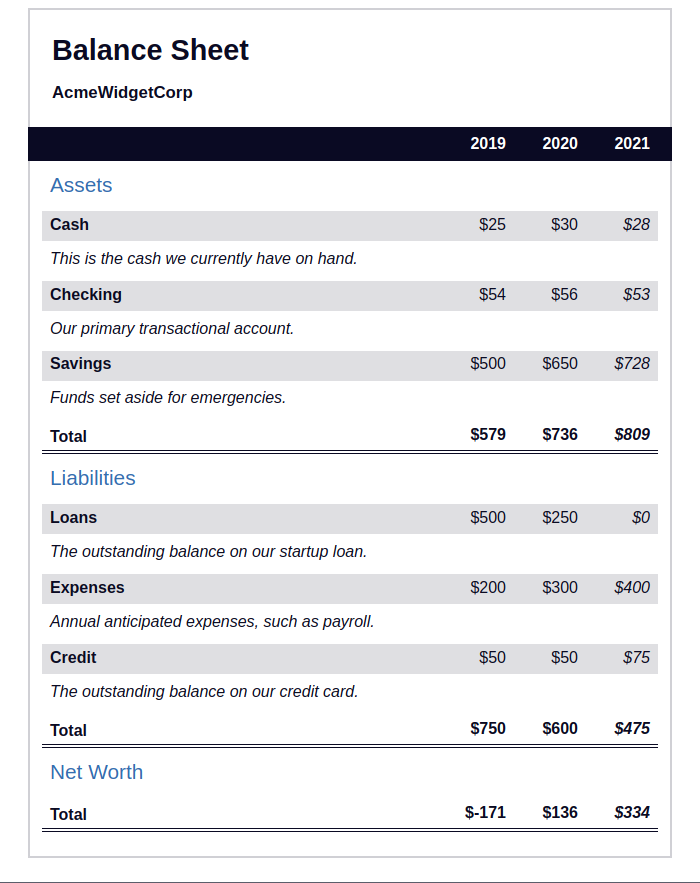

## :pushpin: About:

In this project I learned how to use CSS pseudo selectors to change HTML elements. I was able to add triggers when hovering over an element or clicking on it.

## :confetti_ball: Preview:

---

  Made with 💚  by <strong>Ian Ramos</strong> 🔥
  <a href='https://www.linkedin.com/in/ian-ramos/'>Get in touch!</a>

