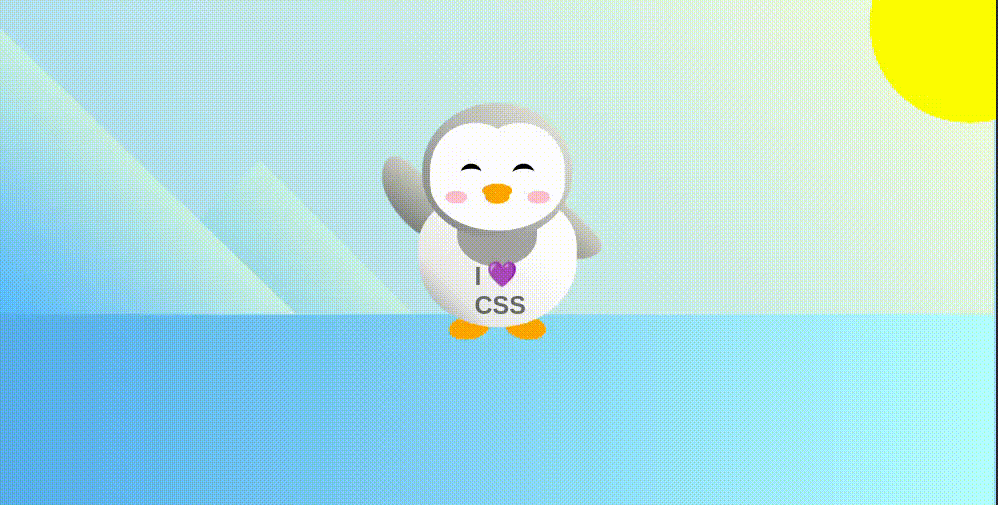

## :pushpin: About:

This was undoubtedly the coolest project of all, where I felt great freedom using CSS to position elements on the page absolutely, transforming them by changing their shape and adding animations to finish.

## :confetti_ball: Preview:

---

  Made with 💚  by <strong>Ian Ramos</strong> 🔥
  <a href='https://www.linkedin.com/in/ian-ramos/'>Get in touch!</a>

