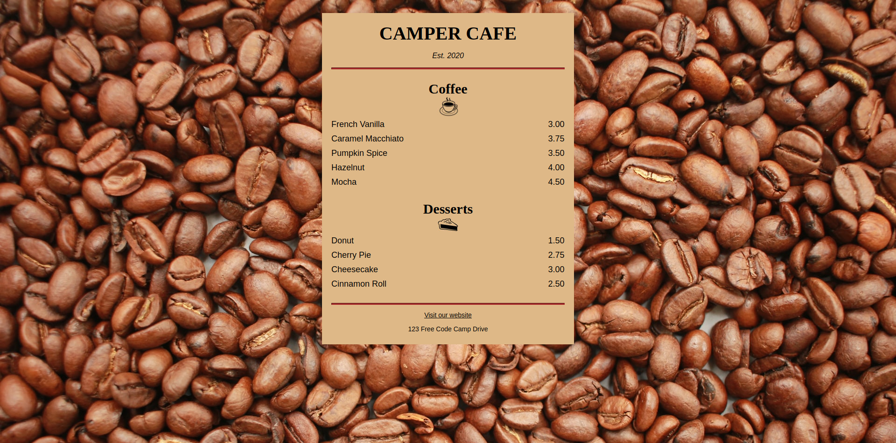

## :pushpin: About:

In this project I developed and styled a page that is a menu for a coffee shop. Here I learned the basics of how to style pages developed in HTML, changing the color of elements, font size and style, background, etc.

## :confetti_ball: Preview:

---

  Made with 💚  by <strong>Ian Ramos</strong> 🔥
  <a href='https://www.linkedin.com/in/ian-ramos/'>Get in touch!</a>

