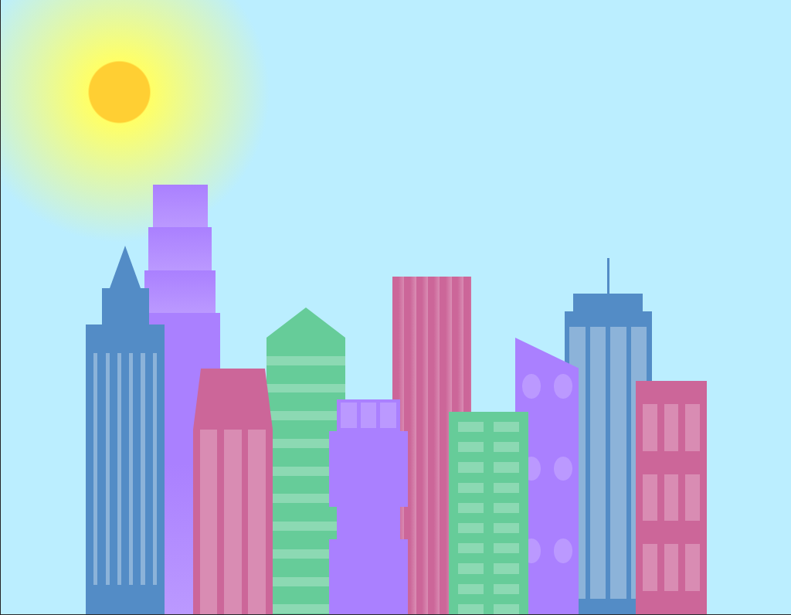

## :pushpin: About:

In this project I developed a city where the colors used were defined through variables in CSS, which can be reused in different styles, avoiding code repetition.
 
Also, I applied responsiveness so that at a certain screen size the city completely changed its color palette, staying day or night.

Use:

- gradient with css (linear and radial)
- css variables
- polygons with border tricks
- absolute and relative positioning

## :confetti_ball: Preview:

---

  Made with 💚  by <strong>Ian Ramos</strong> 🔥
  <a href='https://www.linkedin.com/in/ian-ramos/'>Get in touch!</a>

