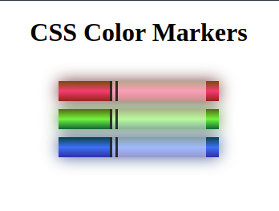

## :pushpin: About:

In this project I developed and styled a color marker. Here I learned about how to add colors to a page, in different ways (hexadecimal, rgb, rgba, hsl), as well as how to combine them so they don't look out of place. I also made use of gradients to give a very interesting effect to the element.

## :confetti_ball: Preview:

---

  Made with 💚  by <strong>Ian Ramos</strong> 🔥
  <a href='https://www.linkedin.com/in/ian-ramos/'>Get in touch!</a>

