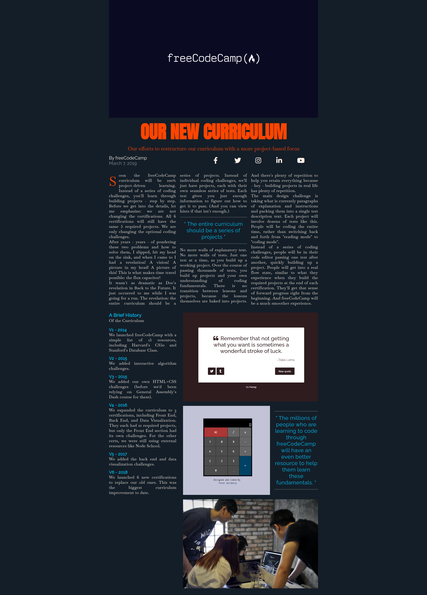

## :pushpin: About:

In this project I learned how to position elements on the page using a CSS feature, the Grid. It is very useful and used in several projects, when we want to position elements in the two dimensions, row and column.

## :confetti_ball: Preview:

---

  Made with 💚  by <strong>Ian Ramos</strong> 🔥
  <a href='https://www.linkedin.com/in/ian-ramos/'>Get in touch!</a>

