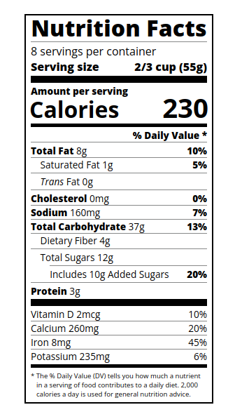

## :pushpin: About:

Typography is the art of styling your text to be easily readable and fit for purpose. In this project I learned how to style text, adjusting its height and positioning it properly on the page using CSS.

## :confetti_ball: Preview:

---

  Made with 💚  by <strong>Ian Ramos</strong> 🔥
  <a href='https://www.linkedin.com/in/ian-ramos/'>Get in touch!</a>

