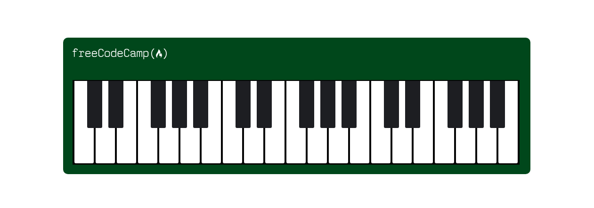

## :pushpin: About:

Responsive design tells your web page how it should look on screens of different sizes. Here I learned exactly that through a piano application, where as the screen decreased in size, fewer keys appeared, and vice versa, thus adapting the image.

## :confetti_ball: Preview:

---

  Made with 💚  by <strong>Ian Ramos</strong> 🔥
  <a href='https://www.linkedin.com/in/ian-ramos/'>Get in touch!</a>

