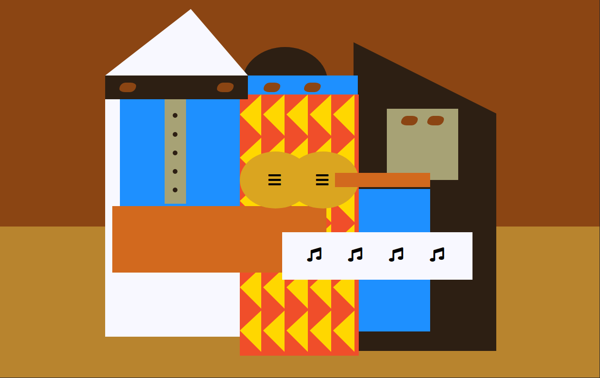

## :pushpin: About:

This project was very interesting because I was able to make a representation of Picasso's painting, using only HTML and CSS, but of course very basic.
Here I met and learned how to use SVG icons and positioning techniques through CSS, in addition to reviewing and improving past learning.

## :confetti_ball: Preview:

---

  Made with 💚  by <strong>Ian Ramos</strong> 🔥
  <a href='https://www.linkedin.com/in/ian-ramos/'>Get in touch!</a>

