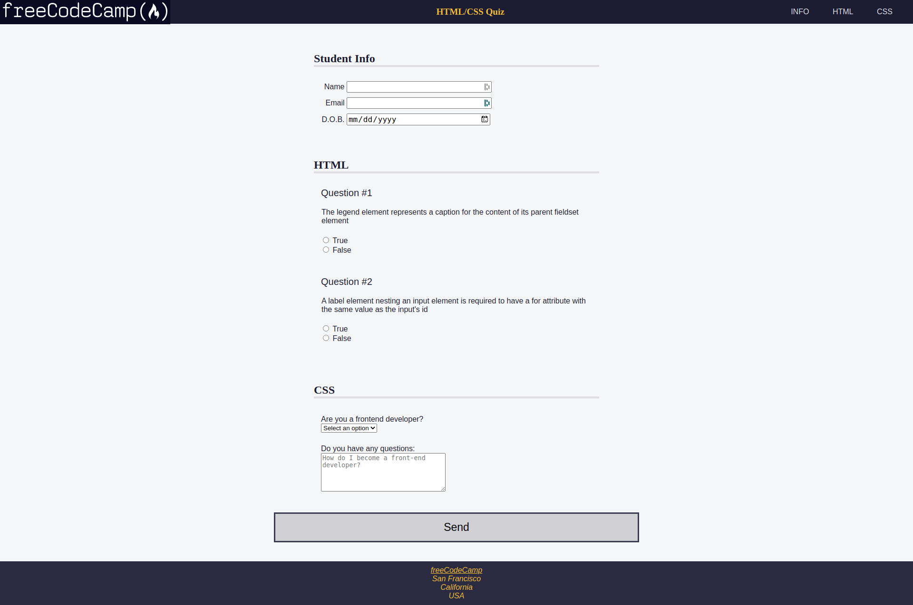

## :pushpin: About:

Accessibility is about making your web page easy to use for everyone – even people with disabilities. In this project I developed a questionnaire, where I learned to use design properties and best practices in both HTML and CSS to make the page easier for people with disabilities to read.

## :confetti_ball: Preview:

---

  Made with 💚  by <strong>Ian Ramos</strong> 🔥
  <a href='https://www.linkedin.com/in/ian-ramos/'>Get in touch!</a>

