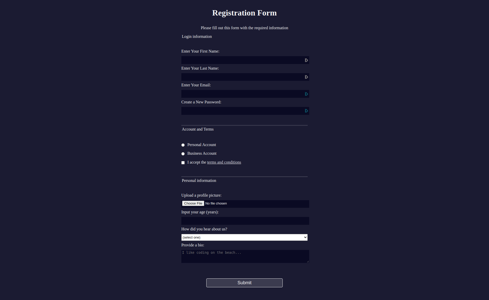

## :pushpin: About:

In this project I developed a form. Here I learned how to receive user data in a form in a correct, semantic, readable and well-structured way, so that the information is transmitted clearly to the user. I also requested different types of data that the user could provide.

## :confetti_ball: Preview:

---

  Made with 💚  by <strong>Ian Ramos</strong> 🔥
  <a href='https://www.linkedin.com/in/ian-ramos/'>Get in touch!</a>

