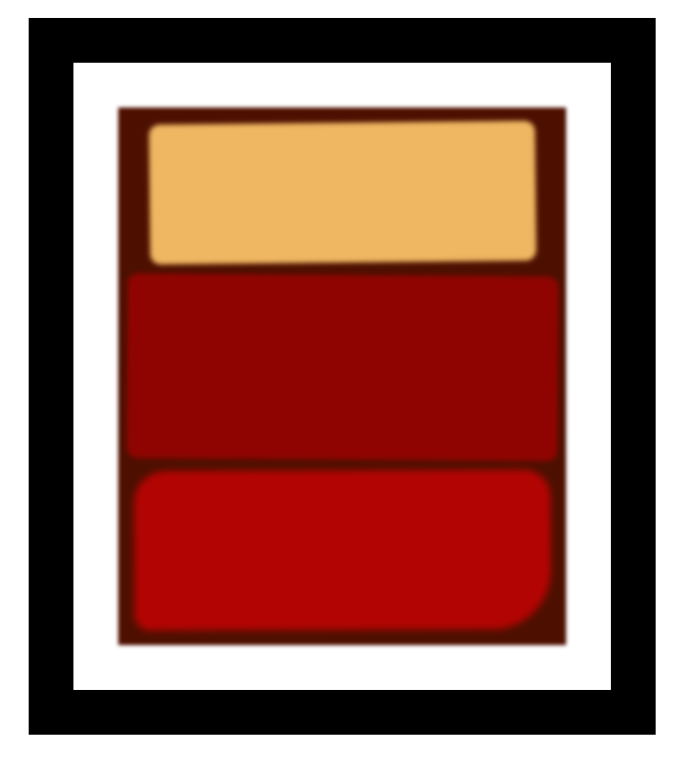

## :pushpin: About:

This project was very interesting, in addition to reproducing, in a very rudimentary way, a real-life work of art, I learned how the elements are defined within a page and how the interaction and separation between them is, in several layers.

## :confetti_ball: Preview:

---

  Made with 💚  by <strong>Ian Ramos</strong> 🔥
  <a href='https://www.linkedin.com/in/ian-ramos/'>Get in touch!</a>

